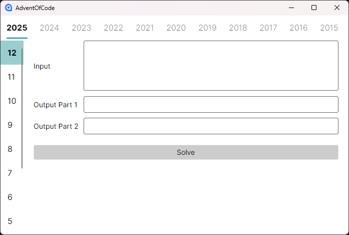

# AdventOfCode

> ⚠️ Hinweis: Bei diesem Projekt handelt es sich um ein Lernprojekt und ist nicht als produktionsreife Software gedacht.

## Über das Projekt

[Advent of Code][AdventOfCode-url] ist ein Adventskalender mit kleinen Programmierrätseln für verschiedene Schwierigkeitsgrade, die in jeder beliebigen Programmiersprache gelöst werden können.

Die Aufgaben dienen der Vertiefung algorithmischer Fähigkeiten und dem sicheren Umgang mit Datenstrukturen und Kontrollflüssen.

Dieses Projekt umfasst eine Sammlung von Lösungen zu verschiedenen Aufgaben vom [Advent of Code][AdventOfCode-url]. Auf diese Weise sollen erarbeitete Lösungen erhalten bleiben und neue Lösungen einen Platz zu Ausprobieren haben.

Die Anwendung bietet:
- Texteingabe für den Rätsel-Input
- Textausgabe der Lösung
- die Möglichkeit zur Auswahl der auszugebenden Lösung

## Screenshots

> 
MainWindow

## Motivation

Dieses Projekt dient dazu:
- Algorithmisches Denken zu trainieren
- Problemlösungsfähigkeiten zu vertiefen
- Umgang mit Datenstrukturen zu verbessern
- Verständnis für Effizienz & Laufzeit auszubauen

Nach erfolgreichem Abschluss meiner Ausbildung habe ich weiterhin den Kontakt zu anderen Anwendungsentwicklern gepflegt und  den stetigen Austausch. 
Einer der größten Gründe für meine Leidenschaft zur Softwareentwicklung ist genau diese Möglichkeit der Problemlösung. Und umso schöner wird es, wenn man damit Freunden helfen kann.

## Architektur & Konzepte

- [Avalonia UI][Avalonia-url] (Cross-Platform Desktop Framework)
- MVVM-Architektur

Der Fokus liegt auf:
- Übersichtliche GUI
- Einfache Bedienung
- Erweiterbarkeit
- Effizienz

## Aktueller Stand

Das Projekt ist funktionsfähig, jedoch noch nicht abgeschlossen. 
Offene Punkte betreffen unter anderem:
- Persistente Speicherung der gelösten Rätsel
  - Rätsel Teil 1 oder 2 gelöst oder noch offen
- Implementierung weiterer Lösungen von Aufgaben aus vergangenen Jahren

<!-- MARKDOWN LINKS -->
[AdventOfCode-url]: https://adventofcode.com/
[Avalonia-url]: https://avaloniaui.net/