# UnRechnung

> ⚠️ Hinweis: Dieses Projekt befindet sich aktuell noch in Entwicklung.
> Es handelt sich um ein Lern- und Praxisprojekt und ist nicht als produktionsreife Software gedacht.

## Über das Projekt

UnRechnung ist eine Desktopanwendung zur Erstellung und Verwaltung von Rechnungen im PDF-Format.

Die Anwendung bietet:
- Automatisch generierte Rechnungsnummern
- Kundenverwaltung mit Kundennummern
- Produktverwaltung zur Verwendung in Rechnungspositionen
- Dashboard mit grafischer Darstellung von Jahreseinnahmen und Übersicht offener Rechnungen
- Persistente Speicherung über [SQLite][SQLite-url]

Dieses Projekt ist mein erstes Vorhaben in dieser Größenordnung. Somit ist das Ziel nicht, eine marktreife Software zu entwickeln, sondern praktische Erfahrung in Architektur, UI-Design und realitätsnahen Anforderungen zu sammeln.

## Screenshots

>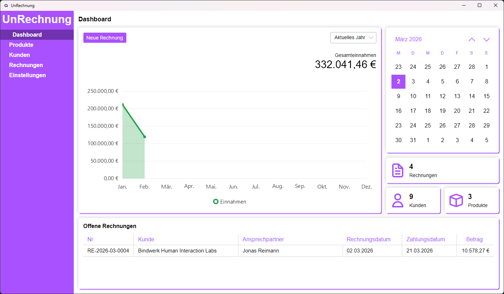 
>Dashboard mit:
>- Shortcut zum Erstellen einer neuen Rechnung
>- Übersicht der Einnahmen für das aktuelle Jahr
>- Kalender
>- Zähler für Rechnunge, Kunden und Produkte
>- Übersicht der offenen Rechnungen

>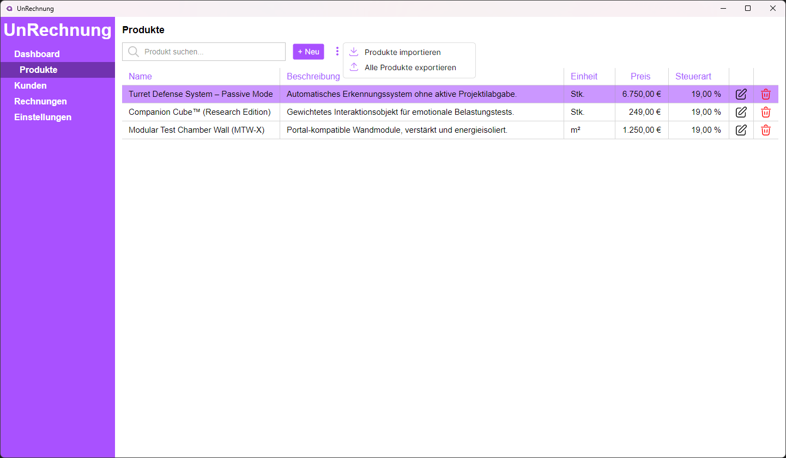 
Produktliste mit:
>- Filterfunktion per Suchleiste
>- Import/Export (bisher nicht implementiert)
>   - Kontextmenü nur zur Demonstration bereits geöffnet
>- Eintrag Bearbeiten & Löschen

>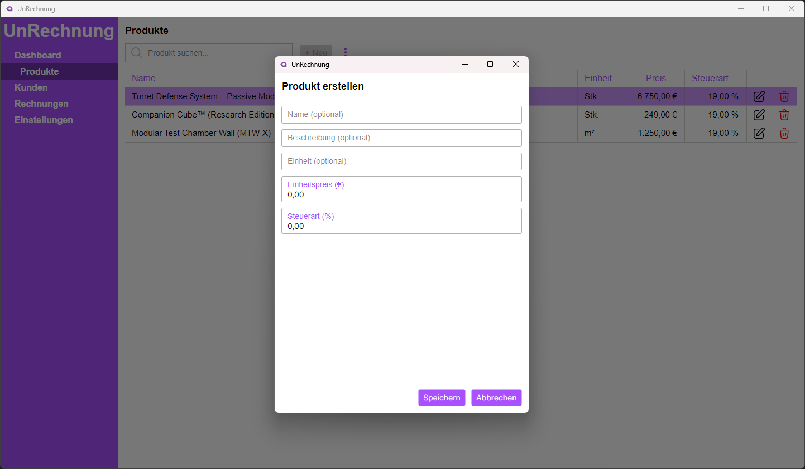 
Dialog zum Erstellen eines neuen Kunden mit automatischer Vergabe der Kundennummer.
Ähnlicher Dialog auch für die Kundenliste.

>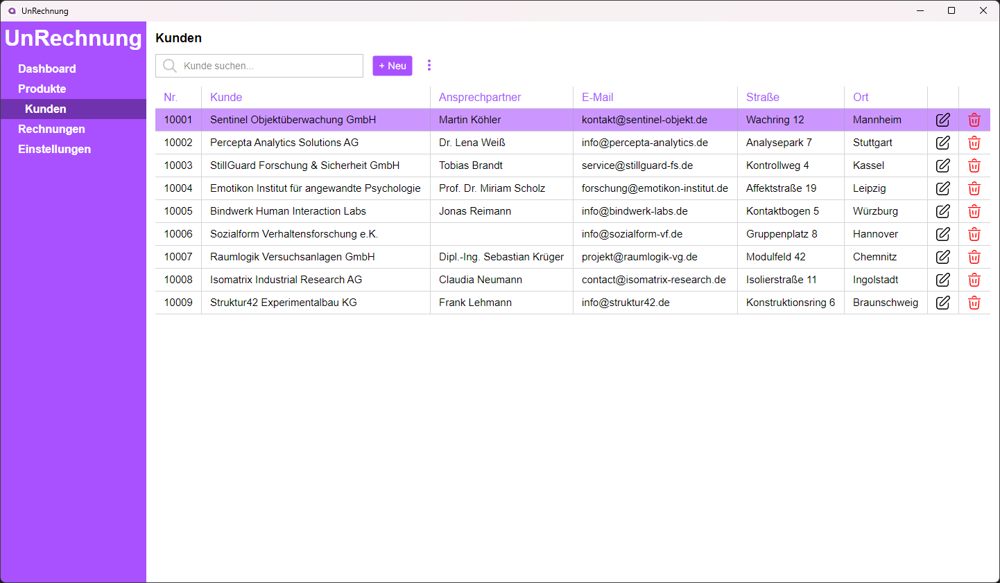 
Kundenliste mit:
>- Filterfunktion per Suchleiste
>- Import/Export (bisher nicht implementiert)
>- Eintrag Bearbeiten & Löschen

>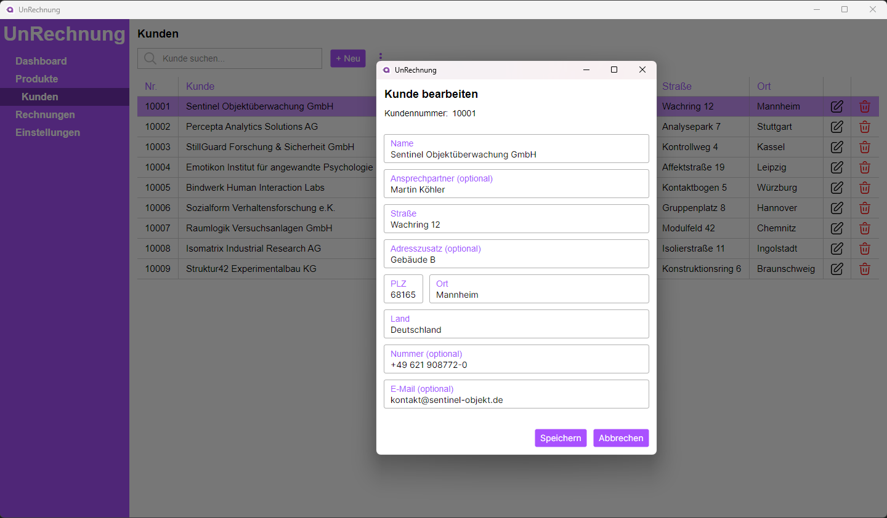 
Dialog zum Bearbeiten eines bestehenden Kunden.
Eine automatische Änderung des Ortes anhand der eingetragenen PLZ ist geplant.
Ähnlicher Dialog auch für die Produktliste.

>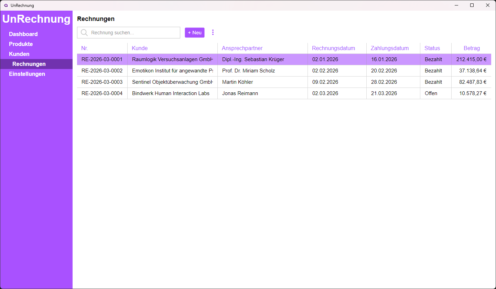 
Rechnungsliste mit:
>- Filterfunktion per Suchleiste
>- Import/Export (bisher nicht implementiert)
>- Bearbeiten vom Zahlungsstatus per ComboBox

>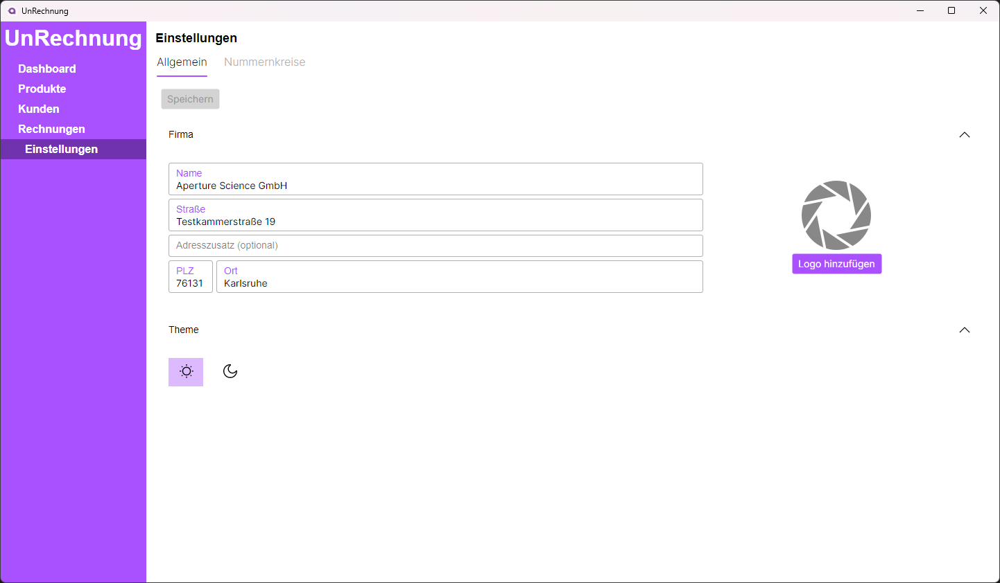 
Nutzereinstellungen mit:
>- Änderungserkennung -> Speichern-Button aktiv & hervorgehoben
>- Auswahl eines Firmenlogos als PNG-Datei mit Sicherheitskopie
>   - Kopiert das Bild in ein festgelegtes Verzeichnis, wo sich auch die Datenbank-Datei befindet, um sicherzustellen, dass das Logo auch verfügbar bleibt, falls der Nutzer die Datei nach dem Einfügen verliert oder löscht
>- Auswahl zwischen hellem und dunklem Design (Funktionsfähig, jedoch bisher ohne ansprechendes dunkles Design)

>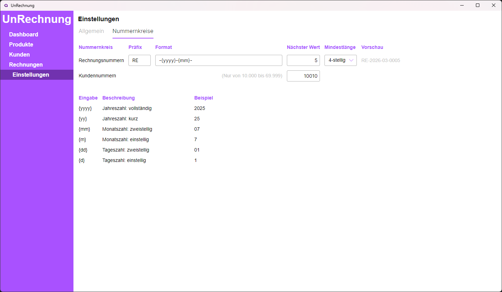 
Nummernkreise mit:
>- Formateinstellungen für die Rechnungsnummern
>- Formatvorschau
>- Anpassungsmöglichkeit des nächsten Wertes für den jeweiligen Zähler
>- Kurzerklärung für Formatierung

>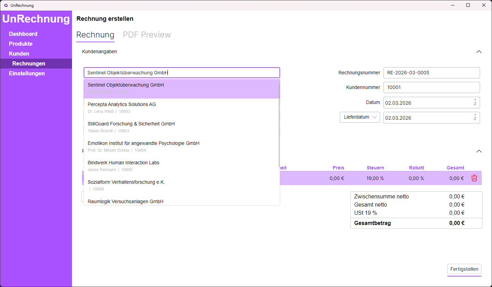 
Rechnung erstellen mit:
>- Suchfunktion für bestehenden Kunden mit automatischem Ausfüllen der Kundenangaben
>- Automatischer Vergabe der Rechnungsnummer nach konfiguriertem Format (siehe Nummernkreise)
>- Automatischer Änderung des Ortes anhand der eingetragenen PLZ (Geplant, jedoch noch nicht umgesetzt)

>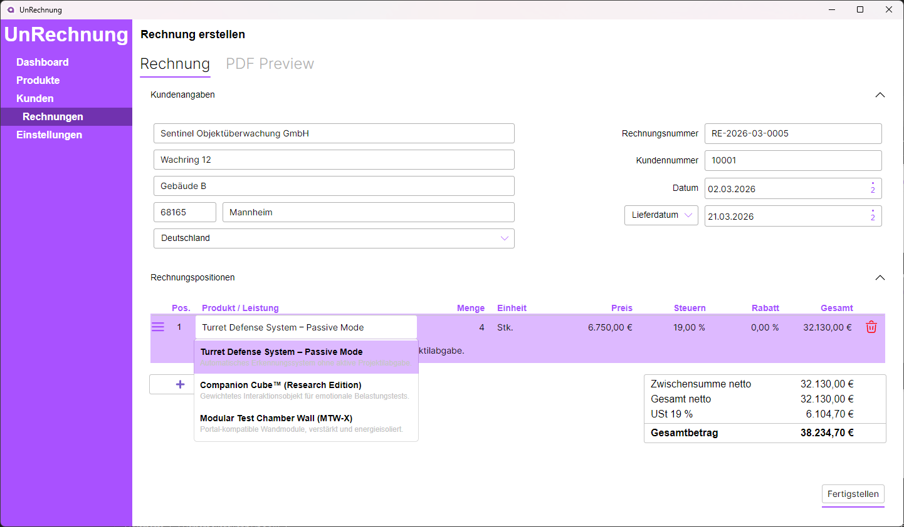 
Rechnungspositionen mit:
>- Suchfunktion für bestehende Produkte mit automatischem Ausfüllen der Produktdaten
>- Automatischer Berechnung des Gesamtpreises je Position Anhand der eingetragenen Stückzahl und des Stückpreises inkl. Steuern
>- Automatischer Berechnung des Gesamtpreises aller Positionen
>- Sortierfunktion der Positionen per Drag & Drop
>- Vorschau der generierten PDF-Datei
>   - Bisher wird die PDF-Datei bei Betätigung des "Fertigstellen"-Buttons sofort erzeugt und in der Vorschau geladen
>   - Geplant ist die Generierung einer temporären PDF-Datei zur Vorschau ohne die Voraussetzung, die Rechnung erst fertigzustellen und in die Datenbank aufzunehmen

>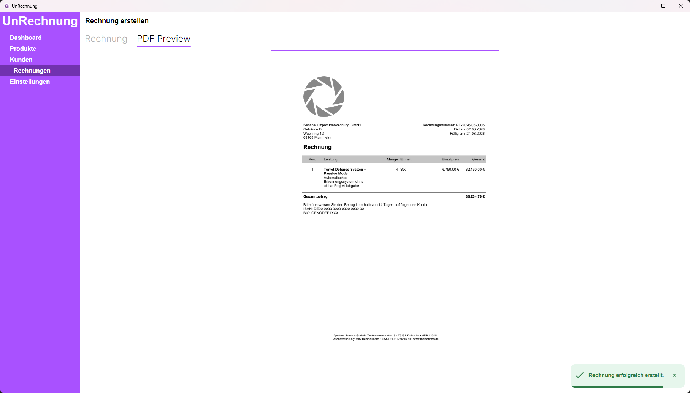 
Vorschau der generierten PDF-Datei.

## Motivation

Dieses Projekt dient dazu:
- moderne UI-Frameworks kennenzulernen
- eine saubere MVVM-Architektur umzusetzen
- Dependency Injection sinnvoll einzusetzen
- mit Entity Framework und [SQLite][SQLite-url] zu arbeiten
- reale Anwendungsanforderungen strukturiert umzusetzen

Die Idee entstand im Austausch mit einer befreundeten, selbstständigen Fotografin, die in ihrer Tätigkeit regelmäßig Rechnungen erstellt. 
Ziel ist es, typische Anforderungen aus einem kleinen Unternehmensumfeld technisch nachzubilden.

## Architektur & Konzepte

- [Avalonia UI][Avalonia-url] (Cross-Platform Desktop Framework)
- MVVM-Architektur
- Dependency Injection
- Entity Framework
- [SQLite][SQLite-url]
- PDF-Generierung
- Trennung von UI, Logik und Datenzugriff

Der Fokus liegt auf:
- Wartbarkeit
- klarer Struktur
- nachvollziehbarer Projektorganisation

## Aktueller Stand

Das Projekt ist funktionsfähig, jedoch noch nicht abgeschlossen. 
Offene Punkte betreffen unter anderem:
- Unterscheidung B2B und B2C
  - korrekte Unterscheidung, wann welche Steuern berechnet werden
- zusätzliche Benutzereinstellungen für Inhalte der PDF-Rechnung
  - möglicherweise Auswahl verschiedener Layouts
- weitere Validierungslogik
- Import/Export für Rechnunen, Kunden und Produkte
- UI- und UX-Feinschliff
- Code-Refactoring einzelner Bereiche

Die Weiterentwicklung erfolgt schrittweise.

<!-- MARKDOWN LINKS -->
[Avalonia-url]: https://avaloniaui.net/
[SQLite-url]: https://sqlite.org