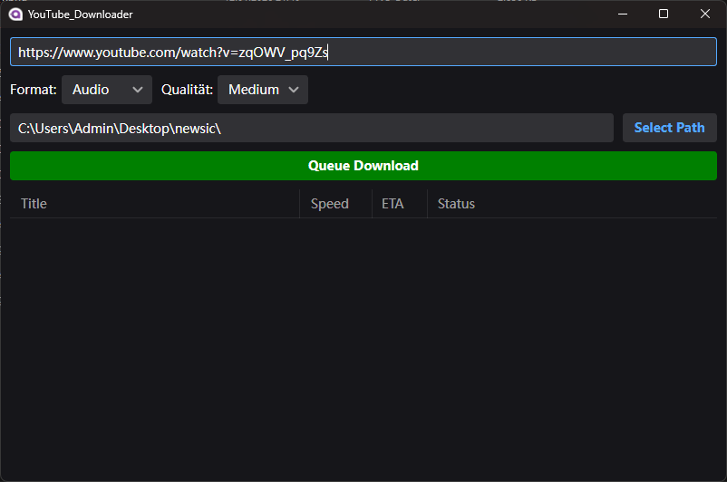
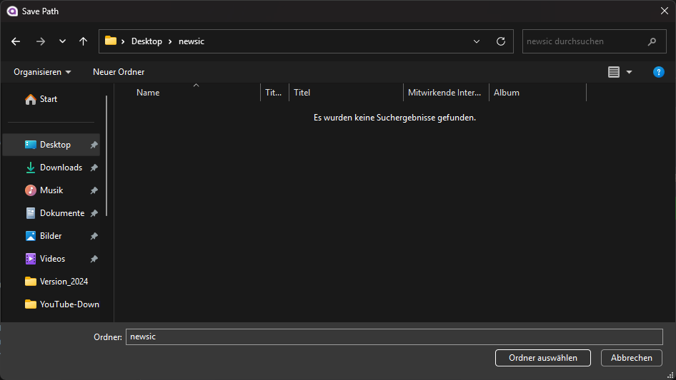
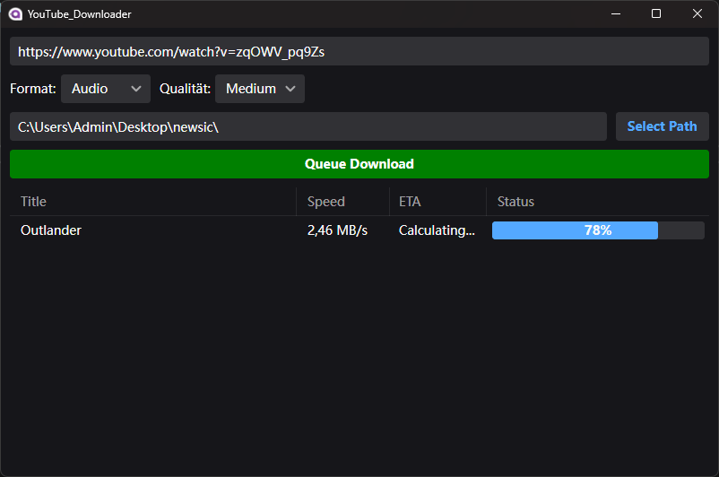

# YouTube-Downloader

> ⚠️ Hinweis: Bei diesem Projekt handelt es sich um ein Lern- und Praxisprojekt und ist nicht als produktionsreife Software gedacht.

## Über das Projekt

YouTube-Downloader ist eine Desktopanwendung, welches eine grafische Benutzeroberflächer zur Bedienung der Konsolenanwendung [yt-dlp][yt-dlp-url] bereitstellt.

Die Anwendung bietet:
- Starten und Überwachen von Download-Prozessen
- Download-Queue
- Fortschritts- und Geschwindigkeitsanzeige
- Auswertung von Prozessausgaben und Statusinformationen

## Screenshots

> 
MainWindow

> 
Zielpfad auswählen

> 
Downloadprozess

## Motivation

Dieses Projekt dient dazu:
- eine GUI für die Bedienung einer Konsolenanwendung zu erstellen
- Download-Prozesse und die damit verbundenen Statusausgaben zu verarbeiten und darzustellen

Da ein Bekannter gelegentlich gerne YouTube-Videos herunterladen möchte und mit der Verwendung einer reinen Konsolenanwendung nicht sehr gut zurecht kommt, kam mir die Idee dieses Projekts, um ihn damit zu unterstützen. 
Einer der größten Gründe für meine Leidenschaft zur Softwareentwicklung ist genau diese Möglichkeit der Problemlösung. Und umso schöner wird es, wenn man damit Freunden helfen kann.

## Architektur & Konzepte

- [Avalonia UI][Avalonia-url] (Cross-Platform Desktop Framework)
- MVVM-Architektur

Der Fokus liegt auf:
- Verarbeitung von Statusausgaben einer Konsolenanwendung
- Grafische Benutzeroberfläche mit übersichtlicher Struktur
- UX

## Aktueller Stand

Das Projekt ist funktionsfähig. 
Mögliche Erweiterungen betreffen unter anderem:
- benutzerdefinierte Dateibenennung
- ein zusätzliches ansprechendes "Helles Design" mit Wechselfunktion zwischen hell und dunkel

<!-- MARKDOWN LINKS -->
[yt-dlp-url]: https://github.com/yt-dlp/yt-dlp
[Avalonia-url]: https://avaloniaui.net/